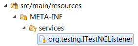

# TestNG Listeners

Many of the features provided by **Selenium Foundation** are driven by **TestNG** listeners.

*   <span style="color: rgb(0, 0, 255);">**ListenerChain**</span> : This listener, which is declared in **TestNG Foundation**, enables the addition of other listeners at runtime and guarantees the order in which they're invoked. This is similar in behavior to a JUnit rule chain.
*   <span style="color: rgb(0, 0, 255);">**ExecutionFlowController**</span> : This listener, also found in **TestNG Foundation**, propagates values stored as test attributes from one phase of test execution to the next.
*   <span style="color: rgb(0, 0, 255);">**DriverManager**</span> : This listener, which is declared in **Selenium Foundation** itself, performs basic functions related to driver session management.

## ListenerChain

**Selenium Foundation** relies on **TestNG Foundation** for basic flow control. At the heart of it all is <span style="color: rgb(0, 0, 255);">ListenerChain. </span>To provide consistent behavior, we recommend that you activate <span style="color: rgb(0, 0, 255);">ListenerChain</span> via the **ServiceLoader** as described in the [**TestNG** documentation](http://testng.org/doc/documentation-main.html#listeners-service-loader):

###### org.testng.ITestNGListener
```
com.nordstrom.automation.testng.ListenerChain
```

In a Maven project, the preceding file is stored in the <span style="color: rgb(0, 0, 255);">src/main/resources</span> package:



Once this file is added to your project, <span style="color: rgb(0, 0, 255);">ListenerChain</span> will be loaded automatically whenever you run your tests. To request dynamic listener chaining, your test class implements the <span style="color: rgb(0, 0, 255);">ListenerChainable</span> interface:

###### Implementing ListenerChainable
```java
package com.nordstrom.example;
 
import com.nordstrom.automation.selenium.listeners.DriverManager;
import com.nordstrom.automation.testng.ExecutionFlowController;
import com.nordstrom.automation.testng.ListenerChain;
import com.nordstrom.automation.testng.ListenerChainable;
 
public class ExampleTest implements ListenerChainable {
     
    ...
  
    @Override
    public void attachListeners(ListenerChain listenerChain) {
        listenerChain.around(DriverManager.class).around(ExecutionFlowController.class);
    }
}
```


As shown above, we use the **`attachListeners()`** callback to attach <span style="color: rgb(0, 0, 255);">DriverManager</span> and <span style="color: rgb(0, 0, 255);">ExecutionFlowController</span>. The order in which listener methods are invoked is determined by the order in which listener objects are added to the chain. Listener _before_ methods are invoked in <span style="color: rgb(153, 204, 0);">last-added-first-called</span> order. Listener _after_ methods are invoked in <span style="color: rgb(153, 204, 0);">first-added-first-called</span> order. Only one instance of any given listener class will be included in the chain.

## ExecutionFlowController

To maintain its settings and state through all phases of each test, **Selenium Foundation** relies on the <span style="color: rgb(0, 0, 255);">ExecutionFlowController</span> listener. This **TestNG** listener propagates values stored as test attributes from one phase of test execution to the next. A bit of background about TestNG test attribute will be helpful in understanding the purpose of this listener.

Each configuration method (i.e. - <span style="color: rgb(0, 0, 255);">`@BeforeMethod`</span> or <span style="color: rgb(0, 0, 255);">`@AfterMethod`</span>) and each test method executed by **TestNG** is given its own private data object to play with - the <span style="color: rgb(0, 0, 255);">ITestResult</span>object. Among its many responsibilities, the test result object maintains a collection of named values - the <span style="color: rgb(153, 204, 0);">attributes</span> collection. **Selenium Foundation** uses this **TestNG** feature to store test-specific values such as driver instance, initial page object, configuration object, and local Selenium Grid process objects.

The <span style="color: rgb(153, 204, 0);">attributes</span> collections are only accessible from the test result object within which they're stored, and each phase of test execution only provides direct access to the "current" test result object - the one owned by the configuration method or test method that's currently being executed. Values stored in the <span style="color: rgb(153, 204, 0);">attributes</span> collection of the <span style="color: rgb(0, 0, 255);">`@BeforeMethod`</span> method don't automatically get propagated to the <span style="color: rgb(153, 204, 0);">attributes</span> collection of the <span style="color: rgb(0, 0, 255);">`@Test`</span> method. Values stored in the <span style="color: rgb(153, 204, 0);">attributes</span> collection of the <span style="color: rgb(0, 0, 255);">`@Test`</span> method don't automatically get propagated to the <span style="color: rgb(153, 204, 0);">attributes</span> collection of the <span style="color: rgb(0, 0, 255);">`@AfterMethod`</span> method.

For tests built on **Selenium Foundation**, we need all of the values stored during each phase of the test to be available to the subsequent phases. The task of propagating test attributes from one phase to the next is handled by <span style="color: rgb(0, 0, 255);">ExecutionFlowController</span>. After a <span style="color: rgb(0, 0, 255);">`@BeforeMethod`</span> method or test method is invoked, <span style="color: rgb(0, 0, 255);">ExecutionFlowController</span> extracts the <span style="color: rgb(153, 204, 0);">attributes</span> collection from this method's result object into its own thread-local storage. Before a test method or <span style="color: rgb(0, 0, 255);">`@AfterMethod`</span> method is invoked, <span style="color: rgb(0, 0, 255);">ExecutionFlowController</span> injects the values it stored from the previous phase into the <span style="color: rgb(153, 204, 0);">attributes</span> collection of this method's result object.

Note that <span style="color: rgb(0, 0, 255);">ExecutionFlowController</span> propagates the entire <span style="color: rgb(153, 204, 0);">attributes</span> collection from phase to phase, not just the attributes created by **Selenium Foundation**. If your test code or page models create test attributes, these will be propagated as well. This provides a convenient, thread-safe way to persist values that are available through the entire test life cycle, which are only visible within the context of the test that created them.

## DriverManager

**Selenium Foundation** includes a **TestNG** listener (<span style="color: rgb(0, 0, 255);">DriverManager</span>) and a static utility class (<span style="color: rgb(0, 0, 255);">GridUtility</span>) that perform several basic functions related to **Selenium** driver session management.

*   Before each test method or <span style="color: rgb(0, 0, 255);">`@BeforeMethod`</span> configuration method is invoked, <span style="color: rgb(0, 0, 255);">DriverManager</span> performs the following tasks:
    *   Ensure that a driver instance has been created for the test.

        *   **NOTE**: For local execution, this may spawn a local instance of **Selenium Grid**.
    *   Store the driver instance for subsequent dispensing.

    *   Manage configured driver timeout intervals.

    *   If specified, open the initial page, storing the page object for subsequent dispensing.

*   When each test method finishes (including <span style="color: rgb(0, 0, 255);">`@AfterMethod`</span>, pass or fail), <span style="color: rgb(0, 0, 255);">DriverManager</span> performs the following tasks:
    *   Terminate any page load operation that's still in progress.
    *   Dismiss any browser alert that's currently open.
    *   Quit the driver, which will close all open browser windows and end the session.

*   After all tests in the entire suite have finished, <span style="color: rgb(0, 0, 255);">DriverManager</span> performs the following tasks:
    *   If a **Selenium Grid** node process was spawned, shut it down.
    *   If a **Selenium Grid** hub process was spawned, shut it down.

# Obtaining a Driver

If you've hooked up <span style="color: rgb(0, 0, 255);">DriverManager</span> as shown above, a driver will be instantiated for your test automatically. To retrieve this instance, use one of the provided static methods:

###### Retrieving the WebDriver instance
```java
package com.nordstrom.example;
 
import org.testng.annotations.AfterMethod;
import org.testng.annotations.Test;
 
import com.nordstrom.automation.selenium.listeners.DriverManager;
import com.nordstrom.automation.testng.ExecutionFlowController;
import com.nordstrom.automation.testng.ListenerChain;
import com.nordstrom.automation.testng.ListenerChainable;
 
public class ExampleTest implements ListenerChainable {
     
    @Test
    public void testDriverAccess() {
        WebDriver driver = DriverManager.getDriver();
         
        ...
    }
     
    @AfterMethod
    public void testDriverAccess(ITestResult testResult) {
        WebDriver driver = DriverManager.getDriver(testResult);
         
        ...
    }
     
    ...
  
    @Override
    public void attachListeners(ListenerChain listenerChain) {
        listenerChain.around(DriverManager.class).around(ExecutionFlowController.class);
    }
}
```


If your test requires a driver that is unavailable via **Selenium Grid**, or if your scenario requires browser setup that can't be established through the standard **Selenium WebDriver** API, **Selenium Foundation** provides two options:

1.  Your test class can implement the <span style="color: rgb(0, 0, 255);">DriverProvider</span> interface to replace the default driver instantiation method with one that meets your requirements.
2.  You can decline automatic driver instantiation for an individual test method by specifying the <span style="color: rgb(0, 0, 255);">`@NoDriver`</span> annotation. This is especially useful in <span style="color: rgb(0, 0, 255);">`@BeforeMethod`</span> methods, as it allows you to defer driver instantiation until the invocation of the test method itself.

###### Implementing the DriverProvider interface
```java
import org.openqa.selenium.WebDriver;
import org.testng.IInvokedMethod;
import org.testng.ITestResult;
 
import com.nordstrom.automation.selenium.interfaces.DriverProvider;
import com.nordstrom.automation.selenium.listeners.DriverManager;
import com.nordstrom.automation.testng.ExecutionFlowController;
import com.nordstrom.automation.testng.ListenerChain;
import com.nordstrom.automation.testng.ListenerChainable;
 
public class ExampleTest implements ListenerChainable, DriverProvider {
     
    ...
     
    @Override
    public WebDriver provideDriver(IInvokedMethod method, ITestResult testResult) {
        return new VivaldiDriver();
    }
     
    @Override
    public void attachListeners(ListenerChain listenerChain) {
        listenerChain.around(DriverManager.class).around(ExecutionFlowController.class);
    }
}
```

###### Deferring driver instantiation with @NoDriver
```java
package com.nordstrom.example;
 
import org.testng.annotations.BeforeMethod;
import org.testng.annotations.Test;
 
import com.nordstrom.automation.selenium.annotations.NoDriver;
import com.nordstrom.automation.selenium.listeners.DriverManager;
import com.nordstrom.automation.testng.ExecutionFlowController;
import com.nordstrom.automation.testng.ListenerChain;
import com.nordstrom.automation.testng.ListenerChainable;
 
public class ExampleTest implements ListenerChainable {
     
    @NoDriver
    @BeforeMethod
    public void noDriverBefore() {
        ...
    }
     
    @Test
    public void testDriverAccess() {
        WebDriver driver = DriverManager.getDriver();
         
        ...
    }
     
    ...
  
    @Override
    public void attachListeners(ListenerChain listenerChain) {
        listenerChain.around(DriverManager.class).around(ExecutionFlowController.class);
    }
}
```

# Specifying Initial Page

Through the <span style="color: rgb(0, 0, 255);">`@InitialPage`</span> annotation, **Selenium Foundation** enables you to specify an initial page that should be loaded after instantiating the driver, on either individual test methods or for an entire test class. Note that any page class specified as an initial page must declare its associated URL via the <span style="color: rgb(0, 0, 255);">`@PageUrl`</span> annotation.

###### Specifying initial page with @InitialPage
```java
package com.nordstrom.example;
 
import org.testng.annotations.AfterMethod;
import org.testng.annotations.Test;
 
import com.nordstrom.automation.selenium.annotations.InitialPage;
import com.nordstrom.automation.selenium.listeners.DriverManager;
import com.nordstrom.automation.testng.ExecutionFlowController;
import com.nordstrom.automation.testng.ListenerChain;
import com.nordstrom.automation.testng.ListenerChainable;
  
import com.nordstrom.example.model.HelpPage;
import com.nordstrom.example.model.LoginPage;
 
@InitialPage(LoginPage.class)
public class ExampleTest implements ListenerChainable {
     
    @Test
    public void testLoginPage() {
        LoginPage loginPage = (LoginPage) DriverManager.getInitialPage();
         
        ...
    }
     
    @Test
    @InitialPage(HelpPage.class)
    public void testHelpPage() {
        HelpPage helpPage = (HelpPage) DriverManager.getInitialPage();
         
        ...
    }
     
    ...
  
    @Override
    public void attachListeners(ListenerChain listenerChain) {
        listenerChain.around(DriverManager.class).around(ExecutionFlowController.class);
    }
}
```


# <span class="confluence-anchor-link conf-macro output-inline" id="SeleniumFoundationTestSupport-auto-driver-target" data-macro-name="anchor" data-hasbody="false"></span>Automatic Driver Targeting

For web applications that use frames or multiple windows, a major source of boilerplate code is management of the driver target. In addition to being extremely repetitive, this code is also surprisingly difficult to implement correctly. **Selenium Foundation** completely eliminates the need for explicit driver targeting. You get to focus on scenario-specific details instead of low-level plumbing.

*   To facilitate automatic driver targeting, **Selenium Foundation** records the associated browser window handle in every page object.
*   If a page-model method returns a new page object indicating that a new window will be opened for it, **Selenium Foundation** automatically waits for the new window to open.
*   For frame-based containers, **Selenium Foundation** retains the strategy used to create them - context element, index, or name/ID.
*   Before invoking a page-model method, **Selenium Foundation** ensures that the driver is targeting the window or frame associated with the method's container object.
*   To avoid unnecessary target switching, **Selenium Foundation** maintains a record of the current target object, only switching when the target object changes.

# Page Load Synchronization

**Selenium Foundation** provides both implicit and explicit page load synchronization. For basic plain-vanilla web applications, implicit synchronization is often all you need. For more complex applications with dynamic content (AJAX, single-page applications, etc.), **Selenium Foundation** defines an interface you can implement to provide scenario-specific detection of page load completion. For more details, see [Building Page Objects with Selenium Foundation](https://confluence.nordstrom.net/display/MTEC/Building+Page+Objects+with+Selenium+Foundation#BuildingPageObjectswithSeleniumFoundation-page-load-sync).

# Driver Lifetime Management and Scenario-Specific Post-Processing

As indicated previously, <span style="color: rgb(0, 0, 255);">DriverManager</span> automatically quits the driver when the test method for which it was instantiated is complete. This is done through the following methods of the <span style="color: rgb(0, 0, 255);">ITestListener</span> interface:

*   **`onTestSuccess(ITestResult testResult)`**
*   **`onTestSkipped(ITestResult testResult)`**
*   **`onTestFailure(ITestResult testResult)`**
*   **`onTestFailedButWithinSuccessPercentage(ITestResult testResult)`**

If you need to perform any post-processing that requires interaction with the browser session (removing test data, logging out, etc.), you have two options - use an <span style="color: rgb(0, 0, 255);">`@AfterMethod`</span> configuration method or a listener that implements <span style="color: rgb(0, 0, 255);">ITestListener</span> attached to the listener chain prior to <span style="color: rgb(0, 0, 255);">DriverManager</span>.

###### Scenario-specific post-processing
```java
package com.nordstrom.example;
 
import org.testng.annotations.AfterMethod;
import org.testng.annotations.Test;
 
import com.nordstrom.automation.selenium.listeners.DriverManager;
import com.nordstrom.automation.testng.ExecutionFlowController;
import com.nordstrom.automation.testng.ListenerChain;
import com.nordstrom.automation.testng.ListenerChainable;
  
import com.nordstrom.example.listeners.ScenarioCleanup;
 
public class ExampleTest implements ListenerChainable {
     
    @Test
    public void testSomething() {
        ...
    }
     
    @AfterMethod
    public void scenarioSpecificCleanup(ITestResult testResult) {
        WebDriver driver = DriverManager.getDriver(testResult);
         
        // perform scenario-specific cleanup
        ...
    }
     
    ...
  
    @Override
    public void attachListeners(ListenerChain listenerChain) {
        listenerChain.around(ScenarioCleanup.class).around(DriverManager.class).around(ExecutionFlowController.class);
    }
}
```


In the example above, the <span style="color: rgb(0, 0, 255);">ScenarioCleanup</span> listener is attached to the listener chain prior to <span style="color: rgb(0, 0, 255);">DriverManager</span>. Consequently, the <span style="color: rgb(0, 0, 255);">ITestListener</span> _after_ methods of <span style="color: rgb(0, 0, 255);">ScenarioCleanup</span> are invoked prior to those of <span style="color: rgb(0, 0, 255);">DriverManager</span>. At this point, the driver will still be open, allowing interactions with the browser session.

The <span style="color: rgb(0, 0, 255);">`@AfterMethod`</span> configuration method in this example is also able to interact with the browser session. Depending on your scenario, you may need to add conditional logic to check the completion status of the test method, but this is easily done through the various status-related methods of the <span style="color: rgb(0, 0, 255);">ITestResult</span> object.